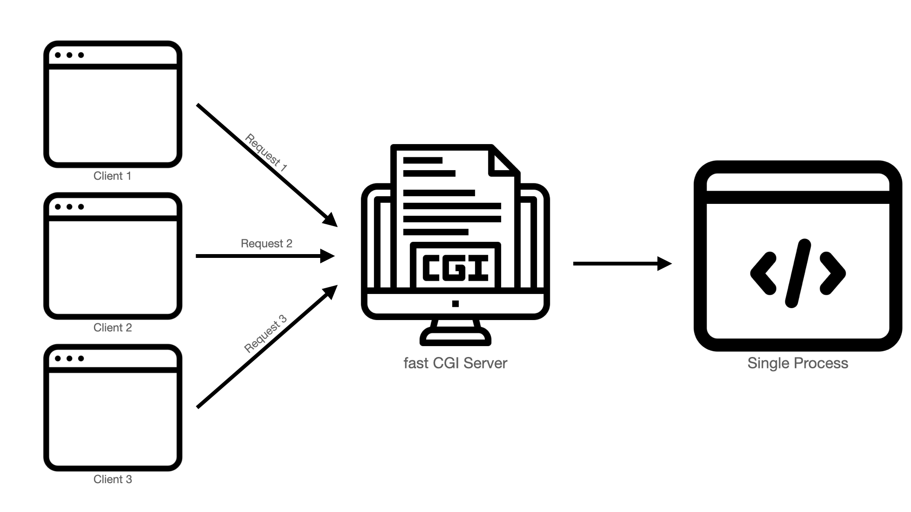

# Inception

아래와 같은 구조로 서비스들을 Docker container로 제공하는 프로젝트.


# Table of Contents

- [Inception](#inception)
- [Table of Contents](#table-of-contents)
- [Docker](#docker)
	- [도커란 뭘까?](#도커란-뭘까)
	- [Docker vs Virtual Machine](#docker-vs-virtual-machine)
	- [Docker image](#docker-image)
	- [Docker container](#docker-container)
		- [pid 1](#pid-1)
		- [볼륨](#볼륨)
		- [네트워크](#네트워크)
- [Docker compose](#docker-compose)
- [Docker in Inception](#docker-in-inception)
- [MariaDB](#mariadb)
	- [MariaDB를 위한 도커 이미지](#mariadb를-위한-도커-이미지)
		- [mysqld_safe의 함정](#mysqld_safe의-함정)
- [Wordpress + fastCGI(Common Gateway Interface)](#wordpress--fastcgicommon-gateway-interface)
	- [Wordpress로 하라는 이유 (아마…)](#wordpress로-하라는-이유-아마)
	- [fastCGI](#fastcgi)
		- [CGI](#cgi)
- [Nginx](#nginx)
- [Nginx-config](#nginx-config)
	- [Nginx TLS](#nginx-tls)
	- [Nginx fastCGI](#nginx-fastcgi)
		- [php-fpm](#php-fpm)
		- [Nginx fcgi](#nginx-fcgi)
	- [Nginx proxy](#nginx-proxy)
- [Redis](#redis)
- [FTP (File Transport Protocol)](#ftp-file-transport-protocol)
	- [active mode](#active-mode)
	- [passive mode](#passive-mode)
	- [FTP의 장단점](#ftp의-장단점)
		- [장점](#장점)
		- [단점](#단점)
	- [FTP vs HTTP](#ftp-vs-http)
	- [ftp-server for linux](#ftp-server-for-linux)

# Docker

## 도커란 뭘까?

도커는 [OS-level](https://en.wikipedia.org/wiki/OS-level_virtualization) 가상화를 통해 컨테이너를 쉽게 다루게 해주는 플랫폼임. 이미지 기반으로 컨테이너를 손쉽게 생성한다는 점으로, 어플리케이션마다 필요한 환경을 구축, 테스트, 배포하기 좋음!

컨테이너 기술은 그 전부터 존재했으며 도커는 이를 정말 잘 활용할 수 있도록 만들어졌을 뿐임.


이와 같이 다양한 기능을 제공하는데, client(shell or docker desktop app)에서 명령을 하면 `Docker daemon`이 이미지와 컨테이너를 관리하고, 필요하면 Registry(주로 Docker hub)에서 이미지를 가져오기도 함.

## Docker vs Virtual Machine

도커와 가상머신은 독립된 환경을 제공한다는 점에서 유사하고, 직접 컨테이너를 사용하면 가상 머신과 큰 차이가 없어 보이지만 컨테이너가 가상머신보다 성능이 훨씬 좋다는 이점이 있음.

이런 차이는 환경을 구축하는 방식에서 비롯되는데, 가상 머신의 경우는 호스트 머신 위에 가상화나 반-가상화를 통하여 새로운 os를 구축하고, 그 위에서 작동하는 방식이지만 도커 컨테이너의 경우는 호스트 머신 위에서 리눅스 커널의 `namespace`, `cgroup` 기능을 통해 작동하기 때문에 훨씬 가볍고 성능이 좋음. [docker container 참고](#docker-container)

또한 도커 컨테이너를 생성하기 위해 만드는 이미지 파일도 레이어로 분할되어 생성되기 때문에 변경점이 있다면 그 레이어만 업데이트하고, 나머지는 캐시되어 있는 데이터를 활용할 수 있기 때문에 이미지 생성 시간이 단축됨. [docker image](#docker-image) 참고


하지만 단점도 존재하는데, process-level의 격리이기 때문에, 상대적으로 보안이 좋지 않음.

## Docker image

도커 이미지는 `Dockerfile`의 instruction들을 기반으로 만들어지며 컨테이너를 생성하기 위한 snapshot 역할을 함.

이때 각 instruction에 따라 layer된 이미지를 생성하는데, 그 구조는 아래와 같음.


각 layer는 READ-ONLY이며 union file system를 통하여 최상위 layer에서 일관성 있는 파일 구조를 확인할 수 있게 됨.

이렇게 layer화된 구조를 가져서, 특정 instruction이 변경되면 모든 이미지를 다시 빌드하는게 아니라, 변경점이 있는 layer부터 빌드할 수 있고, 이전 layer는 cache를 이용하여 빠르게 빌드할 수 있음

<details>
<summary>시간 비교</summary>

다음과 같은 `Dockerfile`을 가지고 이미지를 빌드해보자.

```Dockerfile
FROM alpine:3.14

RUN echo "here is layer 1"
RUN echo "here is layer 2"
RUN echo "here is layer 3"

ENTRYPOINT [ "/bin/sh" ]
```

*첫 빌드*


*같은 이미지를 다시 빌드했을 때*


*layer 2를 변경했을 때*


`time` 명령어를 이용하면 확연한 시간 차이를 볼 수 있음.

</details>

이렇게 READ-ONLY로 만들어진 이미지 위에 R/W인 Container layer를 올리고, 이 layer에서 작업하기 때문에 컨테이너에서 파일을 생성하거나 삭제해도 image layer에는 영향이 없음.

이러한 특징 때문에 이미지는 불변성을 지니고 빠른 빌드타임을 가질 수 있으며 원격 저장소에서 이미지를 pull 받을때 역시 이렇게 중복된 layer를 제외하고 받기 때문에 빠른 속도를 보임.

만약, 컨테이너의 작업 사항을 이미지로 저장하고 싶다면 `docker commit` 명령어를 통해 컨테이너 layer를 이미지로 통합할 수 있음.

## Docker container

컨테이너는 이미지를 통해 생성되는 instance로, 독립된 환경을 제공해주는 프로세스임. [docker image](#docker-image)에서 기술한 것 처럼, 이미지 위에 R/W layer를 올린 형태이며, 컨테이너가 삭제되면 작업 내역도 모두 사라짐.

하나의 빈 레이어만 생성하면 되기 때문에 매우 빠르게 생성할 수 있음!


> 출처 : docker 공식문서
> 

각 컨테이너는 완전히 새로운 환경을 생성한 것 처럼 작동하며 root 디렉토리, pid, 네트워크, 메모리, cpu등을 새롭게 구성할 수 있음.

이는 리눅스 커널의 [namespace와 cgroup](https://github.com/yongjulejule/TIL/blob/main/linux/namespace.md)라는 기능으로 구현됨!

결국, vm과 다르게 컨테이너는 Host os에서 native로 작동하기 때문에 훨씬 가볍고 빠름.(리눅스가 아닌 환경에서는 docker app이 리눅스 환경으로 가상화를 하여 작동함.)


> 컨테이너 프로세스와 init 프로세스의 namespace 비교
> 


> Host에서 실행된 컨테이너 프로세스의 /proc/<pid>/status 파일. NSpid 같은 필드에 두개씩 찍혀있는것 확인 가능.

### pid 1

컨테이너는 독립된 pid namespace에서 실행되기 때문에 내부에서 pid 1을 갖게 되는데, 리눅스의 pid 1은 특별한 작동을 하기 때문에 이를 고려해야함. 

- PID 1은 Linux에서 특별한 의미를 지님. `init` process라고 알려져 있으며 고아나 좀비 프로세스를 적절히 핸들링 해줄 필요가 있음. 또한 PID 1에 시그널 핸들러가 없으면 `SIGTERM`은 아무것도 하지 않음.
- 일반적으론 환경에선 PID 1에 적절한 `init` 프로세스가 할당되지만, 도커에선 `<executable>`이 바로 PID 1로 실행됨.
- 또한 도커를 중단시키는 `docker stop` 명령어는 `SIGTERM` 을 보내서 컨테이너를 중단시키는데, 만약 10초간 컨테이너가 중단되지 않으면 `SIGKILL` 명령어로 프로세스를 예상치 못하게 종료시키며, 문제가 발생할 수 있음!
- Docker에서 [tini](https://github.com/krallin/tini)라는 적절한 initialization process(`SIGTERM` 시그널 핸들링이 잘 되어 있는 프로그램, `SIGTERM`을 받으면 자식 프로세스들에게 보내고, 최종적으로 자기 자신도 종료되는 방식으로 작동)를 `-init`플레그를 통하여 지원하기 때문에 이를 사용하거나, [dump-init](https://github.com/Yelp/dumb-init), [baseimage-docker](https://github.com/phusion/baseimage-docker)같은 프로그램을 사용하여 시작하는것을 추천. (모두 리눅스의 PID 1 역할을 해주는 경량화된 프로그램)
	- docker compose 에서는 init: true 라는 옵션을 통해 간편하게 init 시스템을 구축할 수 있음.

### 볼륨

컨테이너 생성시 로컬에 있는 특정 디렉토리를 컨테이너에 마운트 할 수 있으며 (bind mount), 도커로 볼륨을 생성하여 마운트(volume mount) 할 수도 있다.

- volume mount
    - 도커의 파일시스템을 사용하여 컨테이너들에서 접근할때 효율적임
    - 도커에 의해 관리되어 호스트 시스템의 핵심 기능들과 분리되어 있음
    - 리눅스가 아닌 환경에선 결국 가상화를 통하여 도커가 구동되는데, 이때 가상화된 volume을 마운트하는게 훨씬 성능이 좋음
- bind mount
    - 호스트 os와 파일 시스템을 완전히 공유해서 사용하기 편함
    - 도커 내부에서 호스트의 파일을 건드리기 때문에 보안상 좋지 않음.

Docker 공식 문서는 volume 마운트를 사용하길 강력이 추천하지만 서브젝트 내용상 bind mount처럼 사용하게 됨…

### 네트워크

 컨테이너 생성시 가상 네트워크를 컨테이너에 할당할 수 있으며 컨테이너끼리 통신하기 위해 같은 네트워크로 여러개의 컨테이너를 구성할  수 있다. 네트워크 namespace로 호스트와 격리되며 다양한 방식으로 네트워크를 구성할 수 있음. [공식문서](https://docs.docker.com/network/#network-drivers)

# Docker compose

도커 컴포즈는 docker app의 서비스, 네트워크, 볼륨을 정의하는 yaml 파일임. 컨테이너를 실행하기 위해 volume, network, environment 등 다양한 옵션을 통해 `run` 을 하게 되는데, 이런 복잡한 명령어를 파일에 정의하여 자동으로 컨테이너들을 실행시켜줌.

Linux의 경우 Docker를 설치 하였더라도 따로 설치해야함. Mac이나 Windows 환경에서 사용하는  Docker desktop App에서는 자동으로 설치됨.

또한 필요하다면 이미지를 빌드해주고, 변경사항이 있다면 그 컨테이너만 다시 실행시켜 주며, `.env` 로 환경변수를 설정하고 `depends_on` 을 통해 의존성있는 컨테이너들의 빌드 순서를 정해줄 수 있음!

[도커 컴포즈 공식문서 참고](https://docs.docker.com/compose/compose-file/) 

# Docker in Inception

일반적으론 docker hub에 official image들로 `mariadb`, `nginx`, `wordpress php-fpm` 등 다양한 컨테이너들을 손쉽게 구동할 수 있지만 `alpine`이나 `debian`의 베이스 이미지에서 서비스를 위한 `Dockerfile`을 직접 작성해야함.

`alpine` 리눅스는 굉장히 경량화된 리눅스로 가벼운게 이점인 컨테이너의 특성 때문에 docker image의 베이스로 상당히 많이 쓰이기 때문에 alpine linux로 base를 잡음.

Dockerfile은 다음과 workflow로 작성함

```dockerfile
FROM alpine:3.14

RUN apk update && apk add --no-cache tini;

RUN [필요한 패키지 다운로드]

COPY [필요한 파일 복사]

EXPOSE [사용하는 포트]

ENTRYPOINT ["/sbin/tini", "--", "/tmp/entrypoint.sh"]

CMD ["서비스를 실행하는 커맨드"]

VOLUME [마운트 포인트]
```

필요한 패키지를 다운로드 받는 과정은 주로 `Dockerfile`의 `RUN` 커맨드를 활용하여 image cache를 활용하기 쉽게 구성하였고, 해당 컨테이너에서 서비스를 가동하기 위한 작업은 `entrypoint.sh` 에서 쉘 스크립트를 이용하여 작성함.

`init: true` 옵션을 사용하면 tini 를 설치하지 않아도 되지만, 직접 설치하고 -vvv 와 같은 옵션을 주면 시그널 핸들링 과정을 모니터링 할 수 있다는 이점이 있어서 설치함.

# MariaDB

`MariaDB`는 `RDBMS`(관계형 데이터베이스)로 `MySQL`에서 떨어져 나온 거임. `MySQL`이 `Oracle`에 인수되면서 상업적 이용을 위해선 비용을 지불해야 했고, 이를 맘에 안들게 여긴 `MySQL`의 핵심 창업자 Monty씨가 나와 동료들과 `MySQL`의 코드 베이스를 이용하여 만든게 `MariaDB`(5.5버전 기준으로 포크해서 만들음). `MariaDB`는 현재도 오픈소스로 유지되고 있음. [디비 랭킹 사이트](https://db-engines.com/en/ranking)

`MySQL`과 완벽한 호환성을 위하여 `MySQL` 관련 바이너리를 실행해도 `MariaDB`가 돌아가게 할 수 있음.

분리된 시점이 어느정도 지난 만큼 내부 구조나 성능에 차이가 있긴 함! ([MariaDB vs mysql](https://www.guru99.com/mariadb-vs-mysql.html#:~:text=MariaDB%20has%2012%20new%20storage,in%20MySQL%2C%20replication%20is%20slower.))

## MariaDB를 위한 도커 이미지

`MariaDB`를 로컬에서 직접 설정하려면 `config` 작성, `DB init`, `systemctl` 같은 도구들을 활용하여 하나하나 설정하면 되지만, 도커 이미지를 만들어서 컨테이너로 사용하려면 이 모든 작업이 자동으로 이루어져 유저가 바로 사용할 수 있어야 하고, 최대한 경량화 하는게 좋음.

`Alpine Linux`를 사용하기 때문에 `systemctl`같은 `Mariadb Daemon`을 다루는 도구가 없고, `alpine`에서 `openRC`라는 패키지가 `systemctl`을 대체하는데 도커 `base` 이미지로 받아오는 `alpine linux` 이미지에는 이 패키지도 안깔려있음. 따라서 직접 `mysqld(mariadbd)`를 이용하여 서버를 열어야 함! 

`Dockerfile instruction` 을 이용하여 필요한 `MariaDB` 패키지를 다운받고, 쉘 스크립트에서 초기 DB install을 진행함. 이때 컨테이너 특성상 원격으로 DB에 접근하게 될텐데, root 유저로 원격에서 접근하는 것은 보안상 문제가 있으므로 이 단계에서 유저와 DB를 만들고 적절한 권한을 줘아함.

### mysqld_safe의 함정

`Mariadb` 공식 문서에서 `Mariadb daemon`을 가동시키는 방법으로 `mysqld_safe(mariadbd_safe)`을 사용하길 추천하는데, `mysqld_safe`는 자식 프로세스로 `mariadbd`를 실행하고, 해당 프로세스를 관리해주는 역할을 함. 이때 `SIGTERM`이나 `SIGQUIT`같은 시그널을 받으면 자식인 `mariadbd`에 넘겨서 잘 종료되게 한 뒤 재시작을 시켜버림. 

`Docker`로 `MariaDB container`를 관리하는 입장에서는, 서비스를 종료하고 싶을때 `signal`을 보내도 계속 살아나니 결국 `SIGKILL`으로 `MariaDB container` 를 강제종료 시켜서 이는 예상치 못한 문제를 낳을 수 있음! 따라서 `mariadbd`로 실행을 해야함.

# Wordpress + fastCGI(Common Gateway Interface)

워드프레스는 오픈소스 웹 사이트 제작 도구로 전 세계 웹사이트 시장 점유율 1위를 차지하고 있는 서비스임. 백악관 홈페이지 부터 이노아카 블로그까지 정말 많이 사용됨…! 

하지만 이런 오픈소스의 이점을 살리려면 프로그래밍 언어에 익숙해야 하고 영어에 언어 장벽이 없어야 해서 한국에선 자주 쓰이지 않음

## Wordpress로 하라는 이유 (아마…)

LAMP(Linux + Apache + MySQL + PHP) 스택 이라는 가장 널리 사용되는 웹 앱에 대한 소프트웨어 스택이 있음. 모두 오픈소스 소프트웨어로 상용 패키지를 대체할 수 있음을 소개하기 위해 1998년에 나온 용어이며 워드프레스 같은 웹 프레임워크를 호스팅 하기에 충분한 최초의 오픈소스 소프트웨어 스택 중 하나여서 이 용어와 개념이 인기를 얻음.


> 출처 : [https://en.wikipedia.org/wiki/LAMP_(software_bundle)](https://en.wikipedia.org/wiki/LAMP_(software_bundle))
> 

요즘은 LAMP 스택에서 파생된 LEMP 스택 (apache 대신 nginx), WAMP 스택 (linux 대신 windows), MEAN(MongoDB + Express + Angular.js + Node.js) 등 많은 용어가 나왔지만 구성은 LAMP 스택과 비슷함.

Wordpress는 호스팅 서버가 따로 필요하고, DB와 연결되어 작동하기 때문에 이 LAMP 스택을 활용하기에 정말 좋은 도구임

## fastCGI

### CGI

- Common Gateway Interfaced의 약자. `html`만 제공하다가 외부 앱과 상호작용을 할 필요성을 느껴서 나온 동적 페이지를 제공하기 위한 규격화된 약속. 웹서버와 서로 데이터를 주고받는 방식으로 작동함!
- 어떤 언어로든 작성될 수 있으며 url에 `<protocol>://<domain>/(cgi-bin/<cgi_program_name>|<program>.cgi)` 방식을 주로 씀. 만약 URL에 query string이 있으면 환경변수로 `QUERY_STRING`이 설정되어 `CGI` 프로그램에서 사용할 수 있음.
- `CGI` 프로그램이 요청된 작업을 수행하고 `html`문서 형태로 `stdout`으로 쏴주면, 서버가 받아서 `html` 문서를 유저에게 쏴주는 방식.
    
    
    
- 하지만 1 요청당 1 프로세스를 생성하고, 요청이 끝나면 프로세스가 종료되는 방식이라서 성능이 구림
    
    
    
- `FastCGI`는 프로세스들을 생성해두고, 한 프로세스당 여러개의 요청을 계속 처리함.
- `FastCGI`가 메모리를 더 많이 소모하지만 더 빠름!
    
    
    

`php-fpm`은 `php`에서 공식적으로 `FastCGI`를 지원하면서 만들어진것. (PHP Fastcgi Process Manager)

`Wordpress + php-fpm`은 워드프레스를 `php-fpm`을 이용하여 `FastCGI`로 제공하는것!

[How the web works: HTTP and CGI explained](https://www.garshol.priv.no/download/text/http-tut.html)

[Always Get Better](https://www.alwaysgetbetter.com/2012/01/30/setting-wordpress-nginx-fastcgi/)

[CGI와 FastCGI 알아보기](https://server-talk.tistory.com/308)

# Nginx

Nginx는 가장 인기있는 웹 서버 프로그램이며 웹서버로 시작했지만 리버스 프록시, 로드밸런스를 위해서도 사용됨. 개발 당시 가장 유명했던 아파치 웹서버가 한번에 10만개 이상 연결을 할 수 없다는 한계때문에 만들어졌음. 아파치는 연결 1개당 프로세스 하나를 할당하여 연결을 처리하는 반면 Nginx는 이벤트 중심의 비동기 아키텍쳐로 연결을 처리함. 따라서 적은 메모리 사용량으로 많은 커넥션을 핸들링 할 수 있게됨!

비동기 I/O이기 때문에 큐에 I/O작업이 많이 쌓이는 경우 apache가 더 낫고, 이럴때는 Nginx를 리버스 프록시 서버로 사용할 수 있음.

Nginx는 마스터 프로세스가 있어서 config를 읽고 검증한 후 그에 맞게 적용하고, 워커 프로세스를 생성 및 관리함.

워커 프로세스의 수는 cpu의 코어수, 디스크 수를 고려하여 만들어지며 기본값으로 최대 core 수 만큼 만들어지기 때문에 컨텍스트 스위칭의 비용이 적음. 

또한 Nginx는 웹서버의 역할 뿐만 아니라, 리버스 프록시 서버의 역할도 할 수 있기 때문에 로드밸런싱과 보안상의 이점을 가져올 수 있음.

- 프록시
    
    
    
    - 프록시는 서버와 클라이언트 사이에서 중계역할을 함.  요청을 받으면 프록시 서버를 거쳐 다음 목적지로 가는것. 이는 보안상의 이유로 사용할 수 있고 프록시 서버에서 캐싱을 통해 빠르게 요청에 응답할 수 있다는 장점도 있음.
    - Forward Proxy (proxy)
        - Forward Proxy는 대상에 접근하기 전에 proxy를 거쳐서 접근하는 거임. 만약 보안상 위험이 있거나 악의적인 접근이 있다면 여기서 접근을 제한할 수 있음. 방화벽같은 경우 서버에 접근을 한 뒤 막아주지만 프록시는 문제가 있다면 프록시 서버에서 더이상 진행되지 않기 때문에 이점이 있음.
        - proxy와 vpn(virtual private network)이 비교되는데, proxy는 application level에서 ip만 암호화가 되는 것이고, vpn은 OS level에서 암호화 되기 때문에 ip 뿐만 아니라 모든 데이터가 암호화됨.
    - Reverse Proxy
        - Reverse Proxy는 클라이언트 입장에서 그냥 서버로 요청을 보내는 것 처럼 보임. 하지만 서버 측에 리버스 프록시가 있어서, 서버로 오는 모든 요청은 리버스 프록시를 거침. 이는 다양한 장점을 가져옴.
            - 정적 컨텐츠를 캐싱하여 요청에 빠르게 응답할 수 있음
            - SSL 암호화 같은 작업을 할 수 있어 웹서버의 부하를 줄임
            - 내부 서버의 정보를 숨길 수 있어서 보안상 좋음
- Load balancing
    - Load balancing(부하 분산)은 요청이 너무 많아 여러대의 서버가 필요할때 사용함. 클라이언트의 요청을 가용한 적절한 서버에 보내서 처리함. 만약 서버 하나가 다운되어도 다른 서버에 요청을 전달하면 되니 안정성이 높아지고, 설정이 간단해서 확장성도 좋음. Nginx에선 어떤 방식으로 분산시킬지 정할 수 있음.
    - application level (HTTP level)의 로드벨런싱은 리버스 프록시와 비슷하지만, 리버스 프록시는 HTTP 요청에 국한되는 반면 로드밸런싱은 다른 계층에 대하여도 조절할 수 있음. Nginx에서 제공하는 Load balancing은 HTTP 한정임.
- Nginx with SSL
    - Nginx를 리버스 프록시 서버를 사용하여 모든 요청에 대해 https 연결을 요구할 수 있음.
    - 각 앱마다 SSL을 적용하는건 몹시 힘듦!
    - 하지만 Nginx에서 SSL을 적용하고 리버스 프록시로 활용하여 내부 다른 서버와 소통하면 간단하게 해결됨.
- [SSL, TLS란?](https://github.com/yongjulejule/TIL/blob/main/protocol/SSL-TLS.md)
    - 보안 프로토콜. application layer 하단에 위치함. HTTPS 뿐만 아니라 다른 프로토콜도 암호화 가능 (ftps)
    - TLS(Transport Layer Security)는 SSL(Secure Sockets Layer)이 업데이트 되면서 명칭이 바뀐것.
        - 처음에 SSL로 시작하여 3.0까지 배포되었다가, SSL을 기반으로 다시 만든게 TLS 1.0 이며 SSL은 이제 추방됨.
        - 현재 SSL 인증서라 하면 모두 TLS 인증서임. 관례적으로 SSL이라는 용어를 사용하는것.
    - 연결을 활성화 시키기 전에, TLS handshake 과정을 통하여 암호화된 연결을 수립하고, 이 연결을 통하여 통신함. 이때 신뢰성, 무결성, 개인정보 보호가 보장됨.

# Nginx-config

nginx config 파일은 여러 모듈들 단위로 작성됨. `/etc/nginx/nginx.conf`에 base module이 정의되어 있고 `/etc/nginx/conf.d/`추가적인 모듈들을 정의함.

user, worker_process, error_log, pid 등 다양한 설정을 할 수 있으며 아래와 같이 블록 단위로 설정함.

자세한 내용은 [링크](https://server-talk.tistory.com/303) 참고

```
user  www-data;
worker_processes  auto;

error_log  /var/log/nginx/error.log notice;
pid        /var/run/nginx.pid;

events {
    worker_connections  1024;
}

http {
    include       /etc/nginx/mime.types;
    default_type  application/octet-stream;

    log_format  main  '$remote_addr - $remote_user [$time_local] "$request" '
                      '$status $body_bytes_sent "$http_referer" '
                      '"$http_user_agent" "$http_x_forwarded_for"';

    access_log  /var/log/nginx/access.log  main;

    sendfile        on;
    #tcp_nopush     on;

    keepalive_timeout  65;

    #gzip  on;

    include /etc/nginx/conf.d/*.conf;
}

# /etc/nginx/conf.d/default.conf

	server {
			...
			location / {
					...
					proxy_pass <http://backend:3000>;
			}
	}

```

## Nginx TLS

TLS에 대한 설명은 [링크](https://github.com/yongjulejule/TIL/blob/main/protocol/SSL-TLS.md) 참조

```
server {
    listen       443 ssl http2;
    server_name  ${DOMAIN_NAME};

    access_log  /var/log/nginx/${DOMAIN_NAME}.access.log  main;

    location / {
        root   /var/www/html/wordpress;
        index  index.php index.html index.htm;
    }

    ssl_certificate           ${DOMAIN_NAME}.crt;
    ssl_certificate_key       ${DOMAIN_NAME}.key;
    ssl_session_timeout       5m;
    ssl_protocols             TLSv1.2 TLSv1.3;
    ssl_prefer_server_ciphers on;

	...
}

```

위와 같은 방식으로 nginx에 TLS 설정을 할 수 있음.

`ssl_certificate` : 인증서 파일의 위치
`ssl_certificate_key` : 인증서 파일의 키 파일의 위치
`ssl_session_timeout` : TLS 세션 유효시간
`ssl_protocols` : 사용할 프로토콜
`ssl_ciphers` : 사용할 암호화 방식 기본값은 `HIGH:!aNULL:!MD5` 이며 `openssl ciphers -v "HIGH:!aNULL:!MD5"` 명령어에 대응되는 암호화 방식이 모두 포함됨. [openssl 참고](https://github.com/yongjulejule/TIL/blob/main/openssl/openssl.md),
`ssl_prefer_server_ciphers` : TLS 암호화 방식 협상 과정에서 서버측 암호화 방식 우선.

더 많은 정보는 [nginx ssl config](http://nginx.org/en/docs/http/ngx_http_ssl_module.html), [openssl ciphers](https://www.openssl.org/docs/manmaster/man1/openssl-ciphers.html) 참고

## Nginx fastCGI

### php-fpm

`php-fpm`은 `php`를 `fcgi`모드로 동작하게 해주며, 다양한 최적화가 되어있음

[상세정보](https://opentutorials.org/module/384/4332)

### Nginx fcgi

Nginx에는 `fcgi`을 위한 다양한 config 옵션을 지원함

```
location ~ \\.php$ {
   fastcgi_pass   wordpress:9000;
   fastcgi_index  index.php;
   fastcgi_param  SCRIPT_FILENAME  /var/www/html/wordpress$fastcgi_script_name;
   include        fastcgi_params;
}

```

`fastcgi_pass` : 해당 url로 들어온 요청에 대하여 php-fpm과 nginx을 연결하기 위한 인터페이스를 지정.
`fastcgi_index` : 요청된 URL이 / 로 끝날때 자동으로 덧붙임
`fastcgi_param` : 요청이 fastCGI로 전달되도록 구성하는 지시어.

## Nginx proxy

Nginx를 `reverse proxy`로 활용하기 위한 설정이며 특정 url의 포트로 보낼 뿐만 아니라 http 버전, 헤더, 버퍼 등을 설정할 수 있음.

```
location /backend {
		proxy_pass <http://backend:3000>;
		proxy_http_version 1.1;
		proxy_set_header X-Real-IP $remote_addr;
		proxy_set_header X-Forwarded-Host $host;
		proxy_set_header X-Forwarded-Port $server_port;
}

```

`proxy_pass` : 요청이 들어오면 어떤 url로 전달되는지 지정
`proxy_http_version` : http 버전 지정
`proxy_set_header` : 요청에 대한 헤더 설정


# Redis

- NoSQL, in-memory database로 메모리에 I/O 작업을 하기 때문에 desk I/O 보다 훨씬 빠름.
- 종료시 및 특정 시점마다 디스크에 저장하는 방식으로 작동
- 단일 쓰레딩 모델으로 컨텍스트 스위칭이나 락의 비용이 없음.
- Non-Blocking I/O 모델로 단일 쓰레드임에도 빠름
- 어느정도 데이터가 쌓였을때, 혹은 종료할때 `dump.rdb` 란 파일에 내용을 저장하여 종료하여도 데이터가 남아있음.

# FTP (File Transport Protocol)

`FTP`는 파일 전송 프로토콜으로, 서버와 클라이언트 사이에 파일을 전송하기 위해 나온 것임. 1971년에 나왔으며 연결하기 위해선 로그인을 해야함(서버가 허용한 경우 익명 사용자 가능).하지만 이런 정보가 plaintext 형태로 넘어가기 때문에 보안상 상당히 취약하며, 2021년에 대부분 브라우저에서 지원을 중단하고 `SFTP`(ssh + FTP) 나 `FTPS`(FTP + TLS)를 사용함.

이 `FTP`는  파일 전송을 위해 두개의 포트를 사용하며 한 포트는 연결을 위해 사용하고(command port)  다른 포트는 데이터 전송을 위해 사용하며(data port) 여기서 `passive mode`와 `active mode`로 나뉨.

`command port`는 통상적으로 21번 포트를 사용하지만 `data port`는 `passive mode`와 `active mode`에서 서로 다름.

## active mode

`active mode`에서는 다음과 같이 진행됨

1. 클라이언트에서 임의의 포트(N > 1023)를 `FTP` 서버의 21번 포트에 연결함. (command port)
2. 클라이언트에서 `data port`로 쓸 N+1번 포트의 정보를 서버에게 넘겨줌.
3. 서버는 20번 포트(데이터 포트)에서 클라이언트의 N+1 포트로 연결함. (data port)


이때 client측에서 문제가 발생함. client는 서버와 `data port`로 실제로 연결된게 아니며 단순히 서버에게 `data port`를 위하여 어떤 포트를 Listening 할건지 알려주는 거임. 서버측에서 `data port`로 연결하려고 하면 클라이언트측 방화벽에선 그저 외부 시스템에서 연결을 하려는 것으로 보이기 때문에 방화벽에 막힘.

## passive mode

`active mode`의 문제를 해결하기 위해 등장한 방법이 `passive mode`이며 `PASV`라고도 불림.

`passive mode` FTP에서 클라이언트는 두 연결을 모두 시작하여 방화벽 문제를 해결함.

1. `FTP`연결을 열 때 클라이언트는 두개의 랜덤 포트를 로컬에서 열음.(N>1023, N+1)
2. 첫번째 포트는 서버의 21번 포트에 연결됨.(command port)
3. 클라이언트가 `PASV` 명령을 보내서 서버에서 랜덤 포트 P (p > 1023)을 열고 클라이언트에게 P를 알려줌.
4. 클라이언트는 N+1에서 P로 연결함. (data port)


여기서 서버가 특정 포트들을(`data port`) 열어둬야 한다는 문제가 발생함. 하지만 서버측에서 특정 포트 범위를 `data port`로 쓰도록 설정하여 문제를 해결할 수 있음.

또한 `passive mode`를 지원하지 않는 클라이언트가 있을 수 있으나 요즘엔 그런거 없음.

[active FTP vs passive FTP](http://slacksite.com/other/ftp.html)

## FTP의 장단점

### 장점

- 여러 파일과 폴더를 전송 가능.
- 연결이 끊어지면 전송 재개 가능.
- 전송할 파일의 크기 제한이 없음.
- HTTP보다 빠른 데이터 전송.
- 많은 FTP client가 파일 전송 예약을 지원함.

### 단점

- 내용이 그대로 가서 보안상 매우 좋지 않음.(전송되는 데이터 뿐만 아니라 로그인할때 사용하는 id, password까지 텍스트 그대로 전송됨)
- 적은 용량의 파일을 여러 클라이언트에 연결해야 하는 경우 비효율적임. (이를 위해 HTTP가 나옴)

## FTP vs HTTP

| FTP | HTTP |
| --- | --- |
| 인증이 필요함 | 인증이 필요하지 않음 |
| 대용량 파일 전송에 효율적 | 작은 파일을 전송할 때 효율적 |
| 파일이 메모리에 저장됨 | 메모리에 저장되지 않음 |
| 클라이언트와 서버간에 파일을 다운로드하고 업로드 할때 사용 | 웹페이지 전송에 사용 |
| 상태(state)를 저장하는 프로토콜 | 상태를 저장하지 않는(stateless) 프로토콜 |
| 양방향 통신 시스템 지원 | 단방향 통신 시스템 |
| data connection, command connection으로 나뉨 | data connection만 있음 |

[how ftp works?](https://afteracademy.com/blog/what-is-ftp-and-how-does-an-ftp-work)

## ftp-server for linux

리눅스의 `ftp-server` 프로그램으로 `vsftp`, `pro-ftp`, `pure-ftp`등 다양한 프로그램이 있는데, alpine linux와 호환이 잘되는 `vsftp`를 선택.

`ftp` 특성상 로그인하여 접속하게 되므로 적절한 유저를 잘 생성해줘야 하고, 파일시스템에 접근하기 때문에 권한 설정도 잘 해줘야함. 외부에서 접근할 수 있는 디렉토리를 config파일에 정의해서 특정 디렉토리에만 접근하게 해주고, container로 관리하기 위해 로깅 및 background 설정 정도를 해주면 `filezilla`를 통해 손쉽게 접근 가능해짐.

[vsftpd config](https://2factor.tistory.com/96) 참조
